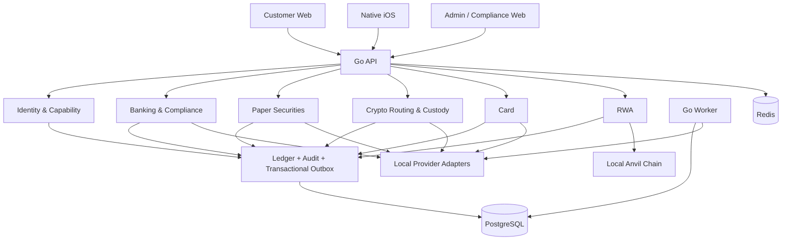

# Cytisus

**A simulation-first financial platform for USD cash, U.S. securities, crypto, card payments, and permissioned RWA workflows.**

Cytisus v1 explores how one unified product could let an eligible individual fund a USD account, invest in U.S. stocks and ETFs, hold and convert crypto, use asset-backed card spending power, and move eligible whole shares into a permissioned on-chain representation.

> [!WARNING]
> **Cytisus v1 is not production-ready and is not a licensed financial service.**
> Every identity, account, quote, order, transfer, card event, provider response, and blockchain transaction in this repository is synthetic or simulated. The repository contains no approval to handle real customer assets, issue a legal security, connect a real provider, or deploy to production.

## Cytisus v1 at a glance

Cytisus is designed as **one financial product across three surfaces**:

- **Customer Web** — research, portfolio management, trading, funding, crypto, and card controls;
- **Native iOS** — everyday account, market, portfolio, card, and security actions;
- **Admin / Compliance Web** — review queues, maker-checker decisions, reconciliation, disputes, and operational controls.

The v1 product model combines:

- USD cash with explicit pending, settled, withdrawable, held, and provisional states;
- simulated U.S. stock and ETF trading;
- simulated ACH and USD Wire funding;
- closed-loop same-name bank withdrawals;
- custodial crypto deposits, withdrawals, and USD-based conversions;
- smart routing across simulated liquidity venues;
- virtual, plastic, and Metal card lifecycles;
- dynamic asset-backed card spending power and protected Auto-Sell;
- permissioned RWA minting backed 1:1 by locked whole shares;
- immutable Ledger, Audit, Transactional Outbox, and reconciliation evidence.

## Core v1 journeys

### Fund and withdraw USD

A synthetic customer can link a same-name bank account and simulate:

- ACH initiation, settlement, and return;
- USD Wire instructions, credit, name mismatch, and return-required handling;
- withdrawal to a previously verified same-name account;
- ownership verification, cooling, and enhanced review for a new withdrawal account;
- maker-checker approval for designated high-risk operations.

Unsettled ACH funds remain separate from settled and withdrawable cash. They cannot be used for crypto withdrawal, real-card cash spending, or other restricted actions.

### Trade U.S. securities

The Paper Securities vertical slice supports:

- searchable U.S.-listed instrument fixtures;
- tradable common stocks and ETFs;
- explicit view-only reasons for unsupported instrument types;
- simulated and honestly labeled quotes;
- Market and Limit orders;
- DAY and GTC time-in-force;
- fractional quantities;
- partial fills, cancellation, and deterministic replay;
- Ledger-backed cash movements and fill-derived positions;
- customer Web and native-client contract coverage.

The broker simulator emits events but cannot write account balances directly.

### Hold and convert crypto

The crypto simulator includes:

`BTC · ETH · SOL · XRP · BNB · DOGE · ADA · AVAX · LINK · LTC · USDC · USDT`

Cytisus uses USD as the only quote and settlement currency:

- USD-to-crypto and crypto-to-USD are explicit;
- cross-asset conversion creates two visible USD legs;
- three simulated venues are ranked by executable net price;
- routing supports splits, partial fills, stale quotes, timeouts, and venue failures;
- price improvement is passed to the customer;
- stablecoins are market-priced rather than hard-coded to USD 1.00;
- deposit and withdrawal states are Ledger-backed;
- withdrawal addresses require native-network allowlisting, risk review, cooling, and activation.

The v1 scope excludes leverage, lending, staking, derivatives, and hidden coin-to-coin routing.

### Spend with a simulated card

The Card MVP models:

- virtual, plastic, and Metal cards;
- a local merchant terminal and NFC-style simulator;
- authorization, hold, partial and final capture;
- tips, reversals, refunds, declines, offline events, and duplicate replay;
- disputes, statements, notifications, and reconciliation;
- original merchant currency plus authorization and clearing FX evidence;
- dynamic spending power backed by eligible assets.

Supported repayment modes:

- `CASH_ONLY`
- `CASH_THEN_AUTO_SELL`
- `MONTHLY_STATEMENT`

Auto-Sell uses a pre-authorized asset waterfall and a protected marketable limit. It never silently falls back to an unprotected market order.

### Mint permissioned RWA

The local RWA environment models a permissioned token on one Anvil-compatible Base environment:

- eligible settled whole shares only;
- one token for each locked underlying share;
- platform Vault custody by default;
- reviewed and permissioned external addresses;
- whitelist transfers, freeze, pause, mint, burn, and forced redemption;
- burn finality before the underlying share is released;
- daily token-supply versus locked-share reconciliation;
- USD cash dividends with no DRIP;
- retry, recovery, replay protection, and DLQ handling.

The local token is a technical simulation and is **not represented as a legally issued security**.

## Product principles

### Truthful simulation

Every simulated capability must be labeled as simulated, delayed, unavailable, or locally generated. Cytisus must never describe fixture data or local providers as real financial infrastructure.

### Trust before growth

The product favors:

- visible fees and exchange-rate evidence;
- clear status, reason, and next action;
- source and freshness labels for market prices;
- explicit risk and compliance states;
- restrained product language instead of gamification or “guaranteed return” claims.

### Assets should not be silently trapped

The product model preserves clear exit paths where eligibility and external providers permit:

1. transfer securities to another broker;
2. mint eligible complete shares into a permissioned RWA representation;
3. sell assets and withdraw USD.

### Server-authoritative controls

Hiding a button is not authorization. Asset availability, financial state, account capabilities, and high-risk actions are validated by backend policy and persisted evidence.

## Architecture

Cytisus uses a **Go modular monolith** with explicit domain boundaries and a common financial core.



Application services own product policy and transaction boundaries. Provider adapters expose capabilities and external events, but cannot mutate Ledger balances.

## Technology stack

| Layer | Technology |
|---|---|
| Backend | Go 1.26 modular monolith |
| Database access | pgx v5, sqlc, explicit SQL, no ORM |
| Primary database | PostgreSQL 17.6 |
| Coordination / local infrastructure | Redis 8.2.1 |
| Customer Web | Next.js 16.2.10, React 19.2.7, TypeScript 5.9 |
| Admin Web | Separate Next.js application using the same API boundary |
| Web testing | Vitest 4, ESLint 9, TypeScript checks |
| Native client | Swift 6.2, SwiftUI, iOS 26 and macOS 26 package targets |
| API contract | OpenAPI 3.1, Redocly validation |
| Financial values | JSON decimal strings and PostgreSQL `NUMERIC(38,18)` |
| RWA contract | Solidity with Foundry / Anvil 1.3.1 |
| Local orchestration | Docker Compose and GNU Make |
| Delivery checks | GitHub Actions, migration replay, secret scanning, container builds |

## Financial correctness and reliability

The financial core is built around the following invariants:

- all financial values use exact fixed-scale decimals;
- floating-point financial values are rejected by repository checks;
- every financial transaction is balanced by currency;
- Ledger transactions and entries are immutable;
- reversals create new opposite postings;
- account balances are derived projections, not directly updated fields;
- request and provider-event idempotency prevent repeated financial effects;
- conflicting reuse of an idempotency key is rejected;
- applicable financial mutations commit Ledger, Audit, and Outbox evidence together;
- worker jobs use leases, retry, exponential backoff, DLQ, and replay;
- reconciliation records discrepancies but does not silently alter cash, positions, shares, or token supply;
- high-risk workflows preserve actor, reason, policy version, and review evidence.

## Repository layout

```text
apps/
  api/              Go HTTP API
  worker/           Outbox, recovery, and background workers
  migrate/          Database migration runner
  simulator/        Local provider and notification simulators
  web/              Customer Next.js application
  admin-web/        Admin / Compliance Next.js application
  ios/              SwiftUI application package

contracts/
  openapi/           Shared OpenAPI 3.1 contract
  rwa/               Permissioned RWA Solidity contract and tests

db/
  migrations/        Reversible versioned PostgreSQL migrations
  queries/           sqlc query sources

internal/
  banking/           ACH, Wire, withdrawal, and reconciliation
  card/              Card lifecycle, spending power, disputes, statements
  crypto/            Assets, routing, custody, and withdrawals
  ledger/            Immutable double-entry financial core
  marketdata/        Instrument catalog and quote fixtures
  rwa/               Share locking, minting, redemption, and recovery
  securities/        Orders, fills, positions, and broker events
  audit/             Immutable audit evidence
  outbox/            Transactional events and delivery

docs/
  evidence/v1/       v1 test evidence and production blockers
  adr/               Architecture decision records

tests/integration/   PostgreSQL / Redis vertical-slice tests
tools/               Finance and migration safety checks
```

## Run locally

### Prerequisites

- Go 1.26+
- Node.js 24+ and npm 11+
- Docker with Compose v2
- GNU Make
- macOS with current Xcode for local iOS builds
- Foundry / Anvil for direct RWA contract development

### Start the environment

```bash
cp .env.example .env
make bootstrap
make compose-up
```

Local services:

| Service | URL |
|---|---|
| Customer Web | `http://localhost:3000` |
| Admin Web | `http://localhost:3001` |
| API health | `http://localhost:8080/healthz` |
| Provider simulator | `http://localhost:8090/healthz` |
| Mail catcher | `http://localhost:8025` |
| Object storage console | `http://localhost:9001` |
| Local Anvil RPC | `http://localhost:8545` |

All local identities, credentials, accounts, assets, orders, transfers, card events, and blockchain activity are synthetic.

## Validation

```bash
make generate
make fmt
make lint
make test
make test-integration
make test-e2e
make migrate-check
make openapi-check
make secret-scan
make build
```

The validation suite covers:

- Go unit and integration tests;
- real PostgreSQL migration up/down/up replay;
- Ledger balance and immutability invariants;
- duplicate request and provider-event handling;
- concurrent financial commands;
- Outbox retry, DLQ, replay, and lease recovery;
- Next.js lint, type checking, tests, and production builds;
- OpenAPI validation;
- Solidity contract tests and local-chain adapter tests;
- secret scanning and container builds;
- Swift model and application checks through macOS CI.

## Current v1 evidence

Prompt 8 evaluated 20 MVP Definition of Done flows using synthetic personas:

- **12 passed**
- **2 partially implemented**
- **5 unimplemented**
- **1 externally blocked**

A passing test command is not the same as a production-ready verdict. Incomplete flows are reported as explicit, reasoned skips.

Evidence:

- [v1 evidence index](docs/evidence/v1/README.md)
- [MVP Definition of Done matrix](docs/evidence/v1/mvp-dod-matrix.md)
- [Automated test evidence](docs/evidence/v1/automated-tests.md)
- [Financial evidence](docs/evidence/v1/financial-evidence.md)
- [iOS evidence](docs/evidence/v1/ios-evidence.md)
- [Security findings and production blockers](docs/evidence/v1/security-and-production-blockers.md)

## Product and engineering specifications

- [Product Development Model](PDM.md)
- [Repository rules](AGENTS.md)
- [Decision Register](DECISION_REGISTER.md)
- [Engineering task plan](CODEX_TASKS.md)
- [Prompt execution sequence](CODEX_CHAT_BOOTSTRAP.md)
- [Machine-readable PDM manifest](pdm_manifest.json)
- [Repository plan](docs/repository-plan.md)
- [Human-owned approvals](docs/human-approvals.md)

## Prompt 0–8 development lineage

The Prompt sequence records how the repository was built; it is supporting history rather than the primary product description.

| Prompt | Scope |
|---|---|
| Prompt 0 | Product model, architecture constraints, decisions, task plan, and execution baseline |
| Prompt 1 | Repository inspection, monorepo foundation, local runtime, CI, and security checks |
| Prompt 2 | Decimal money, immutable Ledger, idempotency, Audit, Outbox, and worker reliability |
| Prompt 3 | Paper Securities vertical slice |
| Prompt 4 | Simulated Banking and Compliance |
| Prompt 5 | Crypto custody and smart routing |
| Prompt 6 | Card MVP simulator |
| Prompt 7 | Permissioned RWA simulator |
| Prompt 8 | Final synthetic E2E execution and evidence |

## Production boundary

The repository does not provide or imply:

- legal, regulatory, tax, securities, banking, custody, or card-network approval;
- a selected licensed production provider;
- real-money readiness;
- production identity verification or enterprise Admin SSO;
- production market-data entitlement;
- production custody keys or provider credentials;
- permission to issue a real RWA security;
- approval to merge protected branches or deploy production automatically.

Do not upload real customer data, enable local simulators in production, expose credentials or private keys, invent provider capabilities, or describe Cytisus as a live financial service.
